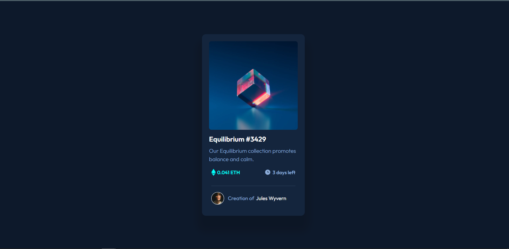
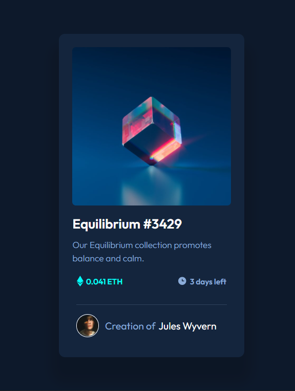

# NFT preview card component solution

## Table of contents

- [NFT preview card component solution](#nft-preview-card-component-solution)
  - [Table of contents](#table-of-contents)
  - [Overview](#overview)
    - [The challenge](#the-challenge)
    - [Screenshot](#screenshot)
    - [Links](#links)
  - [My process](#my-process)
    - [Built with](#built-with)
    - [What I learned](#what-i-learned)
  - [Author](#author)

## Overview

### The challenge

Here See:

-  Layout depending on their device's screen size, mobile and desktop sizes.
-  hover states for interactive elements

### Screenshot
* Desktop view

* Mobile view

* Activite state view

### Links

- Solution URL: [Go solution here](https://github.com/ermix3/NFT-preview-card)
- Live Site URL: [Go live site here](https://ermix-nft-card.netlify.app/)

## My process

### Built with

- Semantic HTML5 markup
- CSS custom properties
- Flexbox
- Mobile-first workflow

### What I learned

* Use the different types of selectors.
* Use hover states.
* Responsive design.

## Author

- Website - [Ermix](https://www.your-site.com)
- Frontend Mentor - [@ermix3](https://www.frontendmentor.io/profile/ermix3)